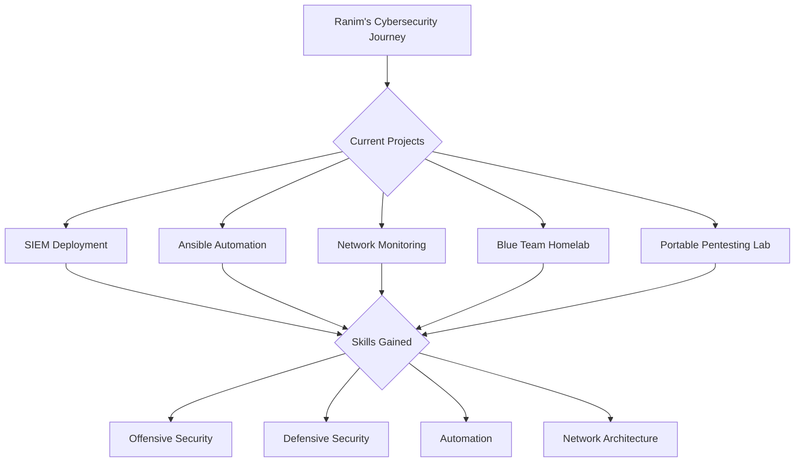

<h1 align="center">
   Ranim Hassine 
</h1>

  

  
  
  

## 🚀 Mission Control

## 💻 Tech Arsenal

  
  
  
  
  
  
  
  

## 🏆 Cybersecurity Achievements

🛡️ SOAR EDR with LimaCharlie and Tines

 
• Deployed LimaCharlie sensors on Windows servers for enhanced endpoint detection and response 
• Crafted Tines stories for automated incident response, improving reaction time to potential threats 
• Integrated Slack and email notifications for real-time alert management

🔍 Blue Team Homelab

 
• Architected a comprehensive security monitoring environment with Active Directory, pfSense, RFDIR, Splunk, and Snort 
• Implemented log aggregation and correlation for enhanced threat detection capabilities 
• Conducted simulated attacks to test and refine defensive measures

🧰 Portable Pentesting Lab

 
• Customized Raspbian OS on Raspberry Pi 4 for mobile security assessments 
• Installed and configured a suite of penetration testing tools for on-the-go ethical hacking 
• Developed custom scripts to automate common pentesting tasks

## 📊 GitHub Stats

  

  

## 🌐 Let's Secure the Digital World Together!

  
  
  

  

<h3 align="center">💼 Open for exciting cybersecurity opportunities! Let's make the internet safer, one commit at a time. 💻🔒</h3>
