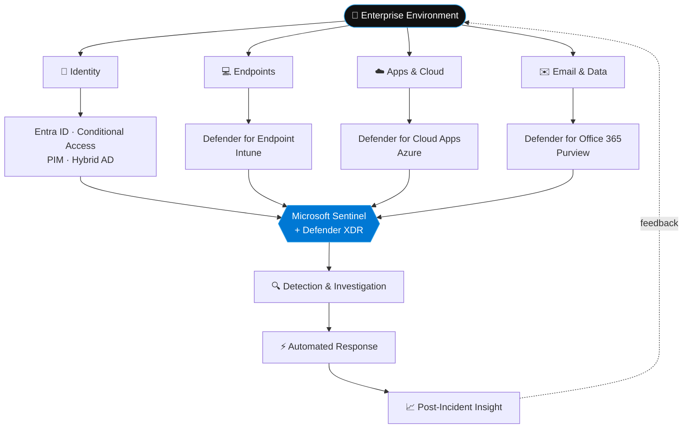

<div align="center">


<br>


<br>

<a href="mailto:ranimhassine@gmail.com"></a>
<a href="https://www.linkedin.com/in/ranimhassine"></a>
<a href="https://github.com/ranimhassine"></a>


</div>

<br>

## 🧩 `whoami`

```yaml
name:        Ranim Hassine
role:        Cybersecurity Consultant
speciality:  Microsoft Security & Microsoft 365
core_focus:  [Identity Security, Endpoint Protection, XDR, SIEM/SOAR, Security Automation]
stack:       [Defender XDR, MDE, MDI, MDO, MDCA, Sentinel, Entra ID, Intune, Purview, Azure, AD]
background:  Electronics & Communication Engineering -> Cybersecurity
mindset:     "Security tools aren't isolated products — they're one architecture."
currently:   Assessments · M365 Security Projects · Identity & Endpoint Security · Presales
```

I work at the intersection of **security engineering and consulting** — assessing enterprise environments, closing configuration gaps, and translating security risk into architecture clients can actually act on. My focus is hybrid environments: where cloud identities, endpoints, SaaS, and on-prem AD all have to be secured *together*, not as separate checkboxes.

<br>

## 🗺️ How I Think About Microsoft Security


```mermaid
flowchart TD
    A(["🏢 Enterprise Environment"]) --> B["🔑 Identity"]
    A --> C["💻 Endpoints"]
    A --> D["☁️ Apps & Cloud"]
    A --> E["✉️ Email & Data"]

    B --> F["Entra ID · Conditional Access<br/>PIM · Hybrid AD"]
    C --> G["Defender for Endpoint<br/>Intune"]
    D --> H["Defender for Cloud Apps<br/>Azure"]
    E --> I["Defender for Office 365<br/>Purview"]

    F & G & H & I --> J{{"Microsoft Sentinel<br/>+ Defender XDR"}}
    J --> K["🔍 Detection & Investigation"]
    K --> L["⚡ Automated Response"]
    L --> M["📈 Post-Incident Insight"]
    M -.feedback.-> A

    style J fill:#0078D4,stroke:#2EA2E7,color:#fff
    style A fill:#111,stroke:#2EA2E7,color:#fff
```

<br>

## 🛡️ Microsoft Security Stack

<p align="center">
  
  
  
  
  
  <br>
  
  
  
  
  
</p>

## ⚙️ Broader Toolkit

<p align="center">
  
</p>

<p align="center">
  
  
  
  
  
  
</p>

<br>

## 🎯 Focus Areas

<table>
<tr>
<td width="50%" valign="top">

### 🔑 Identity Security
- Entra ID, Conditional Access, PIM, MFA, RBAC
- Hybrid identity & Active Directory security
- Excessive privilege, legacy auth, service principal & app-permission exposure
- Mapping identity → resource attack paths

</td>
<td width="50%" valign="top">

### 🕸️ XDR & SIEM/SOAR
- Correlating endpoint, identity, email, cloud & network signals
- Defender XDR + Sentinel integration
- Full lifecycle: surface → telemetry → detection → response → analysis
- Building attack simulation labs

</td>
</tr>
<tr>
<td width="50%" valign="top">

### ⚙️ Security Automation
- PowerShell + Microsoft Graph tooling
- M365 & Entra ID security reporting
- AD & application identity assessments
- Reusable checks across client environments

</td>
<td width="50%" valign="top">

### 🤝 Consulting & Presales
- Security posture assessments & gap analysis
- Risk → business language translation
- Technical workshops & proof-of-concepts
- Client-facing architecture design

</td>
</tr>
</table>

<br>

## 🧪 On My Bench

```text
[■■■■■■■■■□□] Defender XDR ↔ Sentinel correlation labs
[■■■■■■■□□□□] Entra ID privilege & attack-path mapping tooling
[■■■■■■□□□□□] PowerShell + Graph automated M365 security reports
[■■■■■□□□□□□] Identity-relationship visualization dashboards
```

<br>

## 📊 GitHub Stats

<p align="center">
  
  
</p>

<p align="center">
  
  
</p>

<p align="center">
  
</p>

<br>

<div align="center">

### 🔐 Making Microsoft security environments measurable, defensible, and easier to manage — one architecture at a time.


</div>
