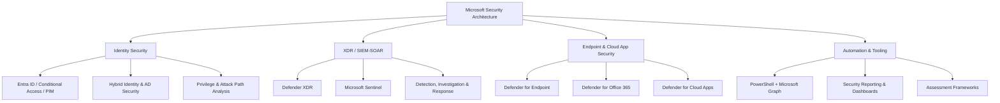

<h1 align="center">
   Ranim Hassine 
</h1>

  

  
  
  

## 👋 About Me

I'm a **Cybersecurity Consultant** specializing in **Microsoft Security & Microsoft 365** environments — identity security, endpoint protection, threat detection, security monitoring, and security automation. My work sits at the intersection of **security engineering and consulting**: designing, assessing, securing, and improving enterprise environments across the Microsoft security stack.

Originally rooted in **electronics and communication engineering**, I built my foundation in networking and systems before specializing in cybersecurity , with a particular obsession for how identities, endpoints, apps, SaaS, and on-prem infrastructure hold together (or don't) in hybrid environments.

At **Consultim IT**, I work on cybersecurity assessments, M365 security projects, identity & endpoint security initiatives, security monitoring, automation, technical workshops, and presales ; turning "secure this environment" into a concrete, deployable architecture.

## 🧭 What I Work On

```mermaid
graph TD
    A[Microsoft Security Architecture] --> B[Identity Security]
    A --> C[XDR / SIEM-SOAR]
    A --> D[Endpoint & Cloud App Security]
    A --> E[Automation & Tooling]

    B --> B1[Entra ID / Conditional Access / PIM]
    B --> B2[Hybrid Identity & AD Security]
    B --> B3[Privilege & Attack Path Analysis]

    C --> C1[Defender XDR]
    C --> C2[Microsoft Sentinel]
    C --> C3[Detection, Investigation & Response]

    D --> D1[Defender for Endpoint]
    D --> D2[Defender for Office 365]
    D --> D3[Defender for Cloud Apps]

    E --> E1[PowerShell + Microsoft Graph]
    E --> E2[Security Reporting & Dashboards]
    E --> E3[Assessment Frameworks]
```

## 🛡️ Microsoft Security Stack

  
  
  
  
  
  
  
  
  
  

## 💻 Broader Toolkit

  
  
  
  
  
  
  
  
  
  

## 🎯 Focus Areas

🔑 Identity Security

 

• Entra ID, Conditional Access, Privileged Identity Management, MFA, RBAC 
• Hybrid identity and Active Directory security 
• Analyzing excessive privileges, legacy auth, service principals & app permissions 
• Mapping attack paths and identity → resource relationships

🕸️ XDR & SIEM/SOAR Integration

 

• Correlating endpoint, identity, email, cloud app, and network signals in Defender XDR & Sentinel 
• End-to-end lifecycle: attack surface → telemetry → detection → investigation → response → post-incident analysis 
• Building attack scenarios and labs to demonstrate detection and containment

⚙️ Security Automation & Tooling

 

• PowerShell + Microsoft Graph scripts for M365 & Entra ID assessments 
• Active Directory security assessments and application identity analysis 
• Turning repeatable security checks into reusable tooling and dashboards

🤝 Consulting & Presales

 

• Security posture assessments and gap analysis 
• Translating technical risk into business-relevant recommendations 
• Technical workshops, proof-of-concepts, and client-facing solution design

## 📊 GitHub Stats

  

  

## 🌐 Let's Connect

  
  
  

  

<h3 align="center">🔐 Making Microsoft security environments measurable, defensible, and easier to manage — one architecture at a time.</h3>
